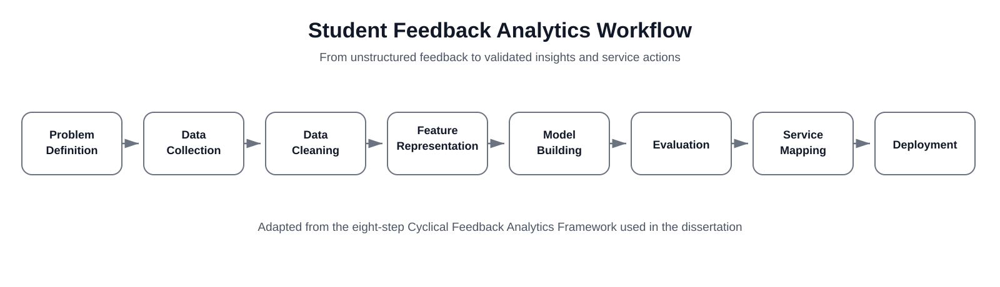
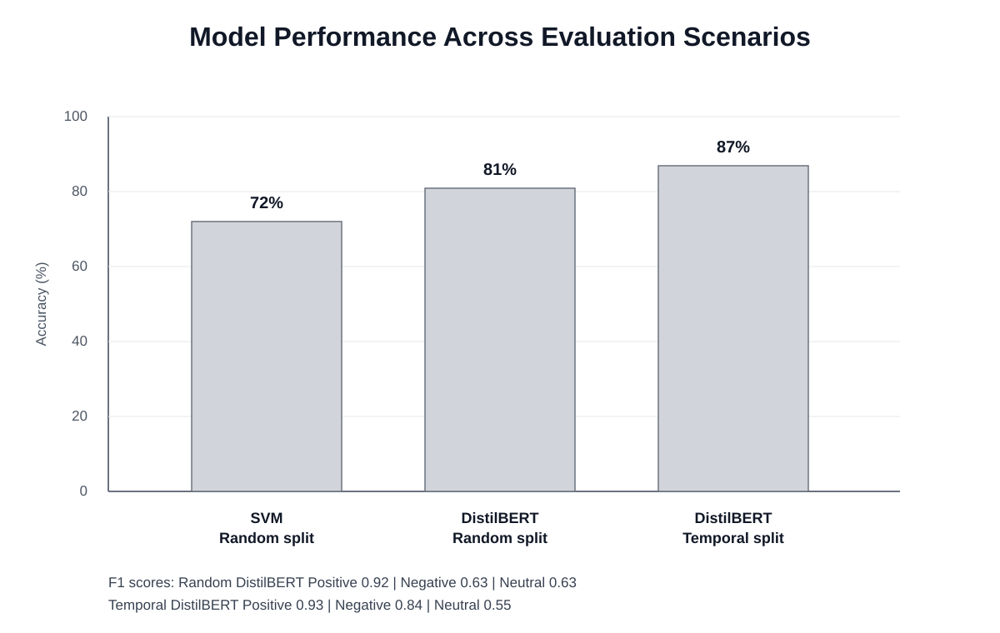
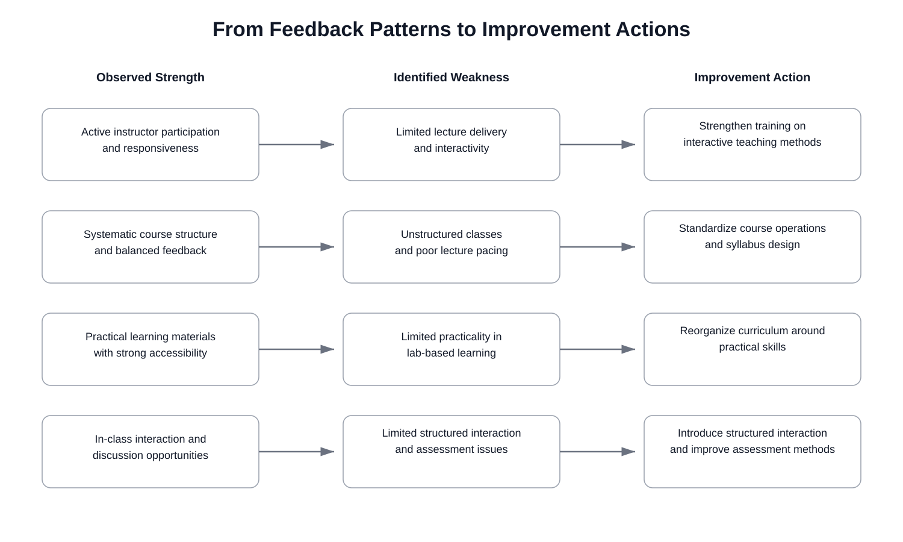

# Student Feedback Sentiment Analysis

**Business Analytics | Python | NLP | DistilBERT | SVM**

This portfolio project is based on my MSc Business Analytics dissertation, **Using Sentiment Analysis to Improve Student Support Services**, completed at Alliance Manchester Business School, The University of Manchester.



## Business Problem

Universities collect large volumes of open-ended student feedback, but free-text comments are difficult to review consistently at scale. The central question was whether this feedback could be converted into a repeatable analysis process that helps identify emerging concerns, validate service strengths, and prioritize improvement actions.

## Project Objective

The analysis was designed to:

1. turn unstructured feedback into a consistent positive / negative / neutral classification;
2. compare a contextual NLP model with a simpler baseline to assess whether added complexity improved classification quality;
3. test whether the model remained useful on future, unseen feedback rather than only a random sample;
4. investigate classification errors that could hide genuine student concerns;
5. translate recurring feedback patterns into practical recommendations for student-support services.

## Data

The original study used **1,178 anonymized student feedback responses** collected through The University of Manchester's official lecture evaluation system across **six semesters from 2022/23 to 2024/25**. The university provided the data for research purposes.

The original feedback text and labeled derivatives are **not included in this public repository**. Although the source data were anonymized, anonymization does not by itself grant permission for public redistribution. A small **synthetic sample** is included only to demonstrate the expected schema and workflow.

## Analytical Approach

### 1. Data quality and preparation

Missing and blank responses, duplicate comments, and comments shorter than three words were removed before analysis. Text was standardized while preserving sentence context required by transformer-based models. This reduced the analytical dataset from **1,178 to 1,022 comments**.

These inclusion rules were kept explicit because they determine which records contribute to downstream sentiment reporting and affect comparability across semesters.

### 2. Reliable ground truth

A three-class coding scheme was used for positive, negative, and neutral sentiment. A 5% re-check of manually labeled feedback produced **98.35% intra-coder agreement**, providing a quality check on the labels used for model training and evaluation.

Validating label consistency before comparing models reduced the risk of attributing poor performance to the algorithm when the underlying classification standard itself was inconsistent.

### 3. Model comparison

The main model was a fine-tuned `distilbert-base-uncased` classifier, compared with a TF-IDF + SVM baseline. The comparison tested whether contextual language understanding produced a meaningful improvement over a simpler approach.

### 4. Future-period validation

Two evaluation scenarios were used:

- **Random split:** stratified 80/10/10 train, validation, and test split.
- **Temporal split:** historical feedback from 2022/23 and 2023/24 used for training/validation, with 2024/25 held out as unseen future data.

The temporal split more closely reflects an operational use case in which a model built on historical feedback is applied to newly arriving comments in a later period.

### 5. Error analysis

Aggregate accuracy was not treated as sufficient evidence of success. Misclassified comments were reviewed to understand where the model could mask complaints or confuse neutral suggestions with other sentiment classes.

This was important because overall model accuracy can remain high even when specific error types create more serious consequences for reporting or prioritization.

### 6. Translating findings into actions

Recurring strengths and weaknesses were mapped to specific areas for improvement, including faculty teaching practices, course structure, practical learning content, and structured student interaction.

## Results



| Evaluation | Model | Accuracy | Positive F1 | Negative F1 | Neutral F1 |
|---|---|---:|---:|---:|---:|
| Random split | DistilBERT | **81%** | **0.92** | **0.63** | **0.63** |
| Random split | SVM | 72% | 0.80 | 0.62 | 0.59 |
| Temporal split | DistilBERT | **87%** | **0.93** | **0.84** | 0.55 |

### Interpretation

DistilBERT outperformed the SVM baseline on the random split, supporting the use of contextual NLP for nuanced feedback. On unseen 2024/25 data, overall accuracy increased to **87%** and negative-class F1 improved to **0.84**, while neutral F1 declined to **0.55**.

The result suggests that the model became stronger at identifying negative feedback in the later period, but neutral and suggestion-oriented comments remained more difficult to classify consistently. For practical use, automated classification could support prioritization, while ambiguous or neutral cases would still benefit from human review.

## Recommendations



The analysis linked recurring feedback patterns to actions such as:

- strengthen faculty training around interactive teaching and responsiveness;
- standardize syllabus structure and weekly learning objectives where course organization is a recurring issue;
- expand practice-oriented cases, projects, and lab activities where students perceive low practical value;
- introduce structured Q&A and mid-semester feedback opportunities to surface concerns earlier;
- retain human review for neutral or ambiguous feedback rather than fully automating decisions.

## Repository Structure

```text
student-feedback-sentiment-analysis/
├── README.md
├── notebooks/
│   ├── 01_data_preprocessing.ipynb
│   └── 02_distilbert_modeling_and_evaluation.ipynb
├── data/
│   └── sample_feedback.csv
├── results/
│   └── model_performance.csv
├── images/
│   ├── 01_feedback_analytics_workflow.svg
│   ├── 02_model_performance.svg
│   └── 03_insight_to_action_map.svg
├── requirements.txt
└── .gitignore
```

## Notebook Notes

The notebooks are cleaned versions of the original dissertation workflow. Exploratory cells, local file paths, private student feedback, and intermediate experiments were removed. The public versions follow the final analytical sequence from data preparation through validation and interpretation.

## Limitations

- The dataset represents a single institutional context, limiting external generalizability.
- Neutral feedback remained more difficult to classify on unseen future data.
- The reported model metrics cannot be fully reproduced from the public repository because the institutional dataset is not distributed.
- Sentiment classification should support, not replace, qualitative review when decisions affect student experience.
