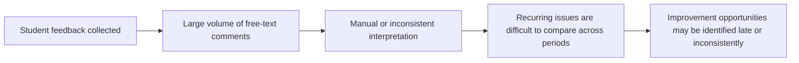
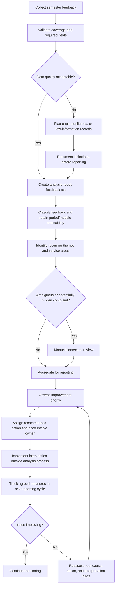

# Feedback Review Process: Problem State to Future State

The dissertation identifies a scalability problem in reviewing large volumes of open-ended feedback and proposes recurring monitoring and reporting. The exact current institutional workflow was not documented, so the first diagram is an **observed problem state**, not a verified current-state process map.

## Observed problem state

## Proposed future-state process

## What changes in the future state

| Dimension | Problem state | Proposed future state |
|---|---|---|
| Data handling | Feedback volume makes consistent review difficult | Explicit quality rules define the analysis-ready population |
| Interpretation | Individual comments can be read in isolation | Comments are organized into recurring themes while retaining context |
| Escalation | No structured distinction between routine and ambiguous feedback | Indirectly negative and ambiguous comments receive manual review |
| Decision-making | Findings can stop at descriptive insight | Themes are translated into improvement priorities and accountable actions |
| Monitoring | One-time analysis | Later reporting cycles are used to determine whether targeted issues persist |

## Control points

1. **Data-quality gate:** reporting should disclose incomplete or potentially unrepresentative inputs.
2. **Human-review gate:** ambiguous comments should not be automatically converted into action without contextual review.
3. **Traceability:** every aggregated issue should remain traceable to reporting period and service area.
4. **Closed-loop review:** recommendations should be linked to a later measurement cycle rather than treated as the endpoint.