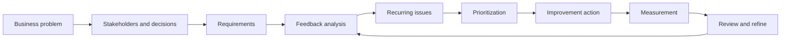

# Business Analysis Artifacts

These artifacts extend the dissertation from an analytical study into a structured service-improvement case study. They distinguish between **evidence demonstrated in the dissertation** and **proposed operating design** that would be required for implementation.

| Artifact | Purpose |
|---|---|
| [Stakeholder and Decision Matrix](01_stakeholder_decision_matrix.md) | Defines who would use the analysis, what they need, and which decisions the process supports. |
| [Feedback Review Process](02_future_state_process.md) | Maps the observed problem state and a proposed closed-loop future process from feedback collection to post-action monitoring. |
| [Business Requirements](03_business_requirements.md) | Translates research findings into traceable requirements, priorities, and acceptance criteria. |
| [Prioritization Framework](04_prioritization_framework.md) | Converts four improvement areas into an evidence-informed implementation sequence without inventing unsupported cost or frequency data. |
| [Risk and Controls](05_risk_and_controls.md) | Connects data limitations and classification errors to decision risks and operational controls. |
| [Measurement and UAT](06_measurement_and_uat.md) | Defines proposed success measures, release controls, and end-to-end UAT scenarios for recurring reporting. |

## Case-study logic

The purpose of this extension is not to relabel a technical project. It is to show how the evidence produced by the dissertation can be translated into requirements, decisions, controls, implementation priorities, and measurable follow-up.